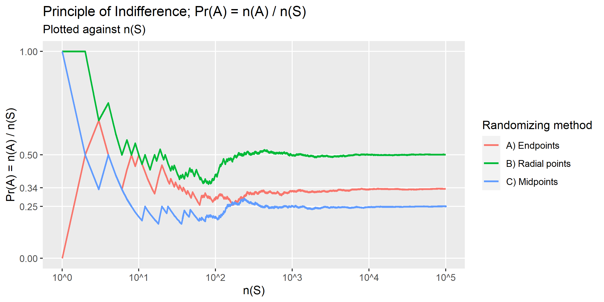

# Results

As the number of outputs $n(S)$ increases, $\Pr(A) = \frac{n(A)}{n(S)}$ converges, depending on randomizing method used, to

| Method | $Pr(A)$ |
| ------ | ------- |
| Random endpoints | $\frac{1}{3}$ |
| Random radial points | $\frac{1}{4}$ |
| Random chord midpoints | $\frac{1}{2}$ |



# Code elaboration

## Equilateral triangle length

[study.com - How to Inscribe an Equilateral Triangle in a Circle](https://study.com/skill/learn/how-to-inscribe-an-equilateral-triangle-in-a-circle-explanation.html) has explained in detail regarding measurements of a equilateral triangle in a circle.

The relevant summary in our case (computing its length) is shown in the picture below:


The equation can be simplified as such:

$$\frac{\sqrt{3}}{2} = \sin(60) = \frac{\frac{s}{2}}{r}$$

$$\frac{\frac{s}{2}}{r} = \frac{\sqrt{3}}{2}$$

$$s = r \times \sqrt{3}$$

Thus the code for computing any circle's corresponding equilateral triangle's side length $s$:

```R
triangle_length <- sqrt(3) * radius
```

## Method 1 (of 3) - random endpoints

For this method, the question instructs to choose two random points on the circumference of the circle, and draw the chord joining them.

For this, we may make use of two random variables corresponding to just the direction/angle of the pair of points from the circle's midpoint, and disregard their exact positions on the circumference as those won't be needed for further computation.

```R
  N <- 1 # Number of samples
  
  a1 <- runif(N, 0, 2*pi)
  a2 <- runif(N, 0, 2*pi)
```

It is obvious from the picture below that directly choosing a random direction from the center is the same as selecting a random point on the circumference and computing its direction.


We may compute the difference of the two random angles by this code snippet

```R
get_endpoint_a_diff <- function(N = 1) {

  a1 <- runif(N, 0, 2*pi)
  a2 <- runif(N, 0, 2*pi)

  adiff <- abs(a1 - a2)

  adiff[adiff > pi] <- 2 * pi - adiff[adiff > pi]
  
  return(adiff)
}
```


However, as illustrated above, it is evident that
  - Having two random variables $a_1 \in (0, 2\pi)$ and $a_2 \in (0, 2\pi)$ is not at all necessary as the difference between the two random angles are also uniform from $(0, 2\pi)$
  - Any reflex angle $a \in (\pi, 2\pi)$ can be expressed as its non-reflex counterpart i.e. $a' = 2\pi-a$
    - Because the random distribution is uniform i.e. $Pr(a < \pi) \approx Pr(a > \pi)$ we could then just generate $a$ from $(0, \pi)$ instead.

```R
get_endpoint_a_diff <- function(N = 1) {
  # Angles of individual points no longer matter

  # Choosing a random value from 0 to pi is sufficient
  # as any reflex angle > pi would have been converted to "< pi" anyway

  adiff <- runif(N, 0, pi)
  
  return(adiff)
}
```

However, as we would be computing the chord length via basic trigonometry, we may assume $\theta$ to be half of the angle difference, and randomize that directly instead, as illustrated below


Thus for this first method (randomize endpoints), we may simply use:

```R
theta <- runif(N, 0, pi / 2)
chord_length <- 2 * sin(theta) * radius
```

## Method 2 (of 3) - random radial points

For this method, the question instructs to choose a random radius of the circle, and a random point on this radius, and draw the chord through this point and perpendicular to the radius.

However, as the selection of radius is not necessary for computing the chord length (as illustrated below), particularly in our computation method, we can skip choosing the radius.


We may then select a random point on the radius length. Or rather, compute the distance $d \in (0,r)$ of the point from the center 

```R
d <- runif(N, 0, radius)
```


Then use the distance $d$ to compute $\theta$ via

$$ \cos{\theta} = \frac{d}{r} $$

```R
d <- runif(N, 0, radius)
theta <- acos(d / radius)

# Which can be further simplified as illustrated below
```


Thus for this second method (randomize radial points), we may simply use:

```R
theta <- acos(runif(N, 0, 1))
chord_length <- 2 * sin(theta) * radius
```

## Method 3 (of 3) - random midpoints

The question instructs to choose a point anywhere within the circle, and construct the chord such that the point chosen is the midpoint of the chord.

We used a solution from [stackoverflow - Generate a random point within a circle (uniformly)](https://stackoverflow.com/questions/5837572/generate-a-random-point-within-a-circle-uniformly) for how to decide on randomizing the position of points, which generates a random direction/angle from the center point and also a random distance from the center to the new point, in a way such that the random points would be uniformly distributed within the circle.

The reason square-root is used in randomizing distance is sufficiently explained in the top answer of the discussion, but the important points are summarized below


Same as previously, we could use the distance $d$ to compute $\theta$ via

$$ \cos{\theta} = \frac{d}{r} $$

```R
d <- radius * sqrt(runif(N, 0, 1))
theta <- acos(d / radius)

# Which can be further simplified as illustrated below
```


Thus for this last method (randomize chord midpoints), we may simply use:

```R
theta <- acos(sqrt(runif(N, 0, 1)))
chord_length <- 2 * sin(theta) * radius
```

End of elaboration

___


# Betrand's Paradox

The Bertrand paradox is generally presented as follows:

> Consider an equilateral triangle inscribed in a circle.
> Suppose a chord of the circle is chosen at random.
> What is the probability $p$ that the chord is longer than a side of the triangle?


Three different solutions are presented, each hinging on the method of generating the random chord:

- **METHOD A (random endpoints)**: Choose two random points on the circumference of the circle, and draw the chord joining them.

- **METHOD B (random radial points)**: Choose a random radius of the circle, and a random point on this radius, and draw the chord through this point and perpendicular to the radius.

- **METHOD C (random midpoints)**: Choose a point anywhere within the circle, and construct the chord such that the point chosen is the midpoint of the chord.

The three different methods above, all seemingly valid, yield different results for the probability in question! The exact answer can be worked out using geometric reasoning, but the goal of this assignment is to provide a visual and empirical way of calculating the probabilities.

## Instructions

> Objective: Show, using simulation and appropriate visualisations, that the three methods above yield different $p$ values.

As a group, you will write R code in a single .R script (named `solution.R`) that performs the intended solutions. This script should be able to be run without errors.

Consider the following points when writing your solutions:

- You are free to choose the format of your solutions (`print()`, `cat()`, data frames, tibbles, ggplots, writing functions, etc.)--but note that marks are awarded for clarity.

- Comment on your code to make its intention clearer (but don't go overboard!)

- You may split the task among yourselves however you wish, as long as there is a proportional effort from all team members.

- If you wish, you may present your solutions within GitHub (e.g. by appending a new section at the top of this README.md file and/or by using GitHub pages).

## Tips

This assignment assumes some basic knowledge of geometry and simple probability, including but not limited to

- The equation of a circle with radius $r$ centred at $x_0$ and $y_0$ is given by $(x-x_0)^2 + (y-y_0)^2 = r^2$ (assuming a cartesian system of coordinates $(x,y)$ ).

- Basic trigonometry angles such as $\sin \theta$ and $\cos \theta$ and Pythagoras theorem $a^2 + b^2 = c^2$.

- Calculating distance between two points in 2-D space (Euclidean distance).

- The principle of indifference: The probability $\Pr(A)$ of an event $A$ happening is given by the ratio of the number of favourable outcomes to the total number of outcomes in the sample space. That is, in a random experiment, suppose $n(S)$ denotes the total number of outcomes, and $n(A)$ denotes the number of outcomes involving $A$, then $$\Pr(A) = \frac{n(A)}{n(S)}.$$

In addition, you might find R's `runif()` function helpful for random number generation.


